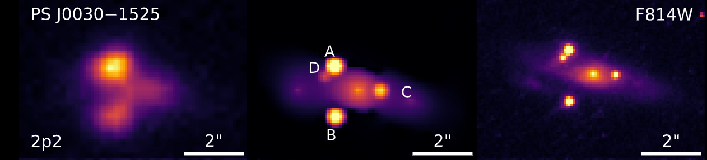

[](https://joss.theoj.org/papers/4c19a3f804d62aafd0ca23f297fce6c9)

[](https://duxfrederic.github.io/lightcurver/)
[](https://www.python.org)
[](https://pypi.org/project/lightcurver/)
[](https://www.gnu.org/licenses/gpl-3.0)


# `lightcurver`
Welcome to `lightcurver`! 
This is a photometry library leveraging [STARRED](https://gitlab.com/cosmograil/starred), 
best used with time series of wide-field images. You can read more about it in the [documentation](https://duxfrederic.github.io/lightcurver/).

Essentially, `lightcurver` provides the infrastructure to 
- prepare a Point Spread Function (PSF) model for each wide-field image, 
- precisely calibrate the relative zero point between each image.

This enables `STARRED` to model the pixels of the region of interest (ROI), 
yielding of course high quality light curves of the point sources in the ROI, 
but also recovering the subpixel information to provide a high signal-to-noise ratio deconvolution of the ROI itself.
The example below shows a cutout of a wide-field image (one in a set of a hundred), 
the model/deconvolution, and the Hubble Space Telescope image of the same region.



## Features
* **Plate solving:** uses [Astrometry.net](https://astrometry.net/) to establish the footprint of each frame.
* **_Gaia_ reference stars:** leverages _Gaia_ information to select the right reference stars in the field of view of each frame.
* **Preserves sub-pixel information**: never interpolates, essential to preserve the sub-pixel information that can be recovered by `STARRED` in a multi-epoch deconvolution.
* **Incremental:** uses `SQL` queries to dynamically determine which process needs be executed on which frame. 
* **Semi-automatic:** create a `yaml` configuration file once for the first few frames, then run the 
pipeline whenever a new frame is added, providing auto-updating light curves.

## Getting Started
1. **Installation**: the short version, install via `pip`:

    ```
    pip install lightcurver
    ```
   [The slightly longer version](https://duxfrederic.github.io/lightcurver/installation/), in case you plan on using a GPU or the plate solving.
2. **Tutorial**: follow the [tutorial](https://duxfrederic.github.io/lightcurver/tutorial/) of the documentation, which provides a dataset you can experiment with.

You can also test your installation with a subset of the dataset provided in the tutorial:
```bash
cd /clone/of/lightcurver
pytest .
```

## Contributing
If you're encountering problems, then I would like to hear about them and will try to fix them. Feel free to create an issue
in this repository.
If you're finding this package useful and want to contribute, please create a pull request after forking the repository.
If you need general help, feel free to [reach out](mailto:frederic.dux@epfl.ch)!

## License
`lightcurver` is licensed under the GPL v3.0 License. See the [LICENSE](LICENSE) file for more details.

## The implemented processing steps
This is an overview of the steps taken by the pipeline.

