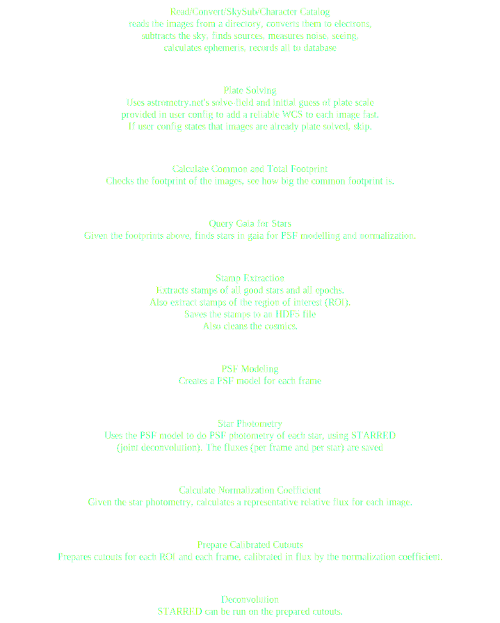

# LightCurver 

Welcome to `lightcurver`! 
This is a photometry library leveraging [STARRED](https://gitlab.com/cosmograil/starred), 
best used with time series of wide-field images. 
`lightcurver` essentially prepares a Point Spread Function (PSF) model for each wide-field image, before using it
to precisely calibrate the relative zero point between each image.
Finally, `STARRED` models the pixels of the region of interest, 
yielding of course high quality light curves of the point sources in the region of interest, 
but also recovering the subpixel information to provide a high signal-to-noise ratio deconvolution of the region of interest itself.
The example below shows a cutout of a wide-field image (one in a set of a hundred), 
the `lightcurver` / `STARRED` model, and the Hubble Space Telescope image of the same region.


## Getting Started

1. **Installation**: Clone the repository and install via `pip`:

    ```
    git clone git@github.com:duxfrederic/lightcurver.git
    cd lightcurver
    pip install -e lightcurver
    ```

2. **Usage**:
There are several steps before you can start analyzing your wide field images.
- Define a working directory, we will call it `workdir`. 
- Create a subdirectory, `header_parser`, in `workdir`, and create a python file: `$workdir/header_parser/parse_header.py`.  This file should contain a function, `parse_header`, which should extract the exposure time, the gain, and the MJD or some other time information. See the [example header parser](docs/example_header_parser_functions/) directory for an example.
- Copy the [example config file](docs/example_config_file/config.yaml), and modify it with your information.
Now you can run `lightcurver`:
    ```python
    # important before importing: tell the code where your config file is
    import os
    os.environ['LIGHTCURVER_CONFIG'] = "/path/to/your_config.yaml"

    from lightcurver.pipeline.workflow_manager import WorkflowManager
    wf_manager = WorkflowManager()
    wf_manager.run()
    ```
`lightcurver` will run several steps of analysis on your wide-field images, like a pipeline.

## The implemented processing steps


## Contributing

We welcome contributions from the community! Whether you're fixing a bug, implementing a new feature, or improving documentation, your efforts are highly appreciated. Please read our [contribution guidelines](CONTRIBUTING.md) to get started.

## License

LightCurver is licensed under the GPL v3.0 License. See the [LICENSE](LICENSE) file for more details.

## Contact

Have questions or suggestions? Feel free to open an issue, a pull request, or [reach out](#)!
