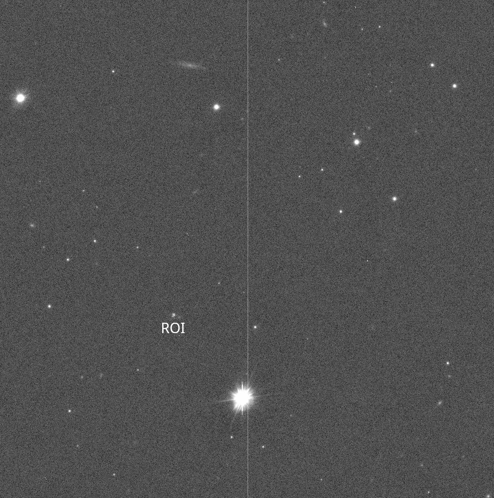
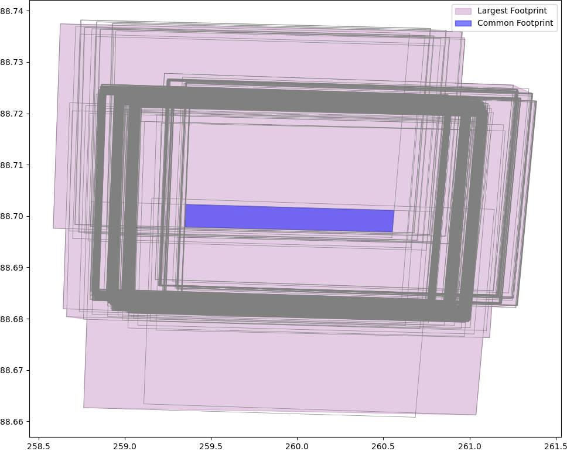
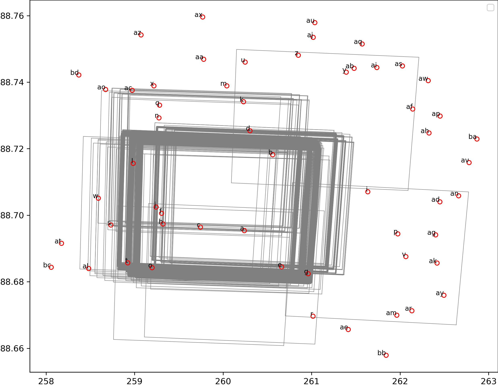
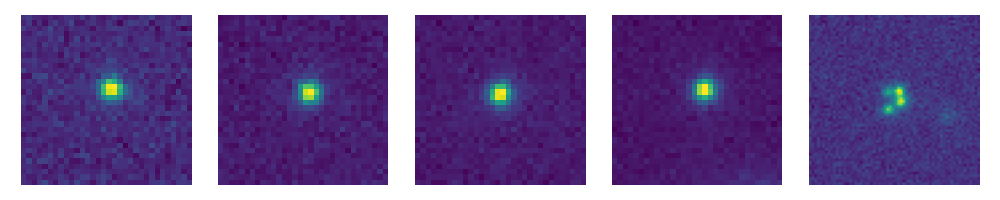
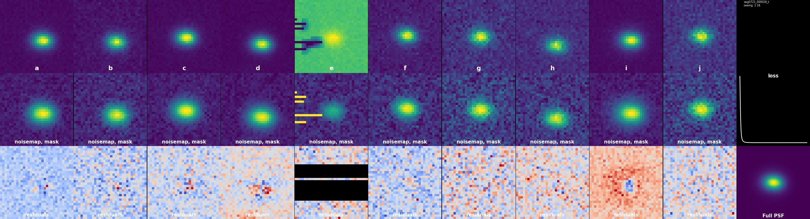
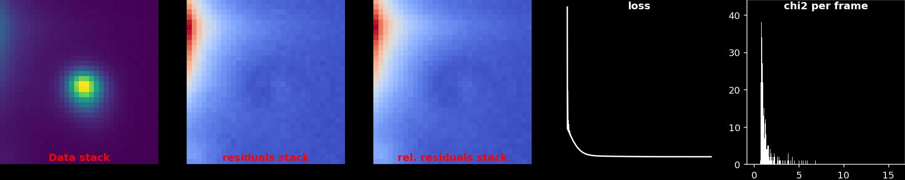
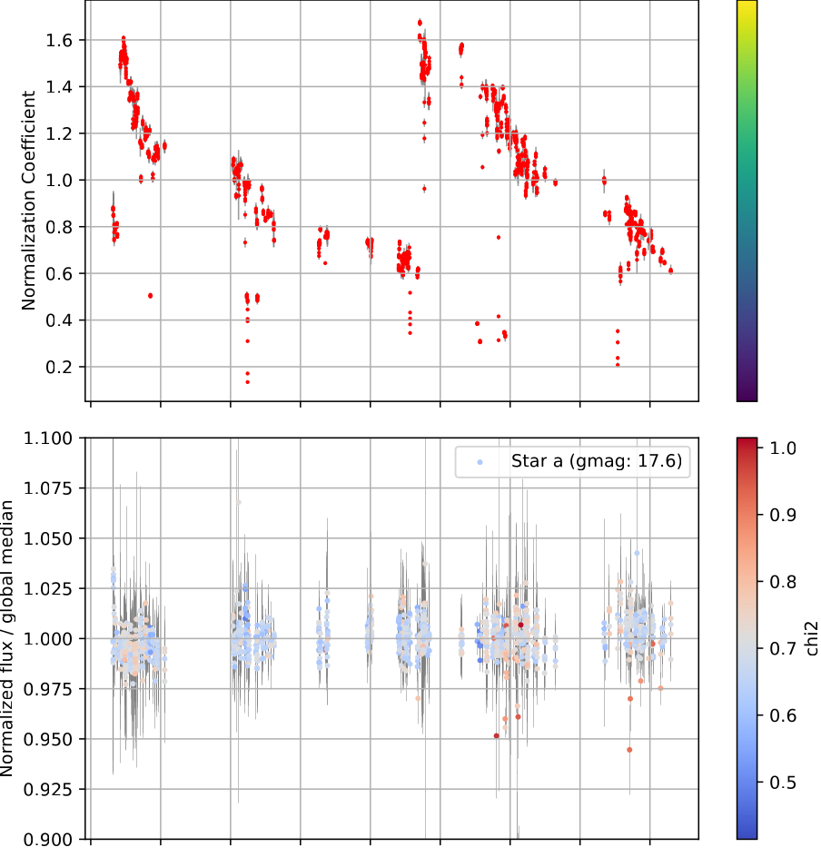

<div class="annotate" markdown>
# LightCurver tutorial

## Introduction
By default, `lightcurver` is a pipeline which executes all its steps sequentially, 
through the `lightcurver.pipeline.workflow_manager.WorkflowManager` class.
So, the most basic python script executing the pipeline would be as follows:

```python
import os
os.environ['LIGHTCURVER_CONFIG'] = "/path/to/config.yaml"

from lightcurver.pipeline.workflow_manager import WorkflowManager
wf_manager = WorkflowManager()
wf_manager.run()
```

Where the `config.yaml` file needs to be carefully tuned before execution. You should always start from 
[this template](https://github.com/duxfrederic/lightcurver/blob/main/docs/example_config_file/config.yaml).

In this tutorial, we will first execute each step manually rather than executing the pipeline through the `WorkflowManager`.

I will provide you with some wide field images that you can use to follow along. Note the following:

* The images are already plate solved, such that you will not need to install `Astrometry.net` on your computer.
Your real life examples will most likely not be, so you should consider installing it.
* Things will be excruciatingly slow if you do not have a GPU. I would consider using only 4-5 frames in this case.

You can work in a jupyter notebook or just write python scripts with the commands we will execute below.
## Preparing the working directory and data

The example dataset consists of a few frames from the monitoring of a lensed quasar with the VLT Survey Telescope (VST).
You can find it at this [link](https://www.astro.unige.ch/~dux/vst_dataset_example.zip), but we will download it below anyway.
Start by creating a working directory. I will assume the working directory `/scratch/lightcurver_tutorial`, please
replace this with your own.
```bash
export workdir='/scratch/lightcurver_tutorial'
mkdir $workdir
```
Let us store our raw data in this working directory as well for the sake of the example, but of course it could be
anywhere, including on a network drive.
```bash
cd $workdir
wget https://www.astro.unige.ch/~dux/vst_dataset_example.zip
unzip vst_dataset_example.zip
```
Your data will now be at `/scratch/lightcurver_tutorial/raw`, here is what a single frame looks like, with the region
of interest marked:


The pipeline also expects a function able to read the header of your fits files. Store the following python function:
```python
def parse_header(header):
    from dateutil import parser
    from astropy.time import Time
    exptime = header['exptime']
    gain = header['gain']
    filter = header['filter']
    time = Time(parser.parse(header['obstart']))
    return {'exptime': exptime, 'gain': gain, 'filter': filter, 'mjd': time.mjd}
```
in this file: `$workdir/header_parser/parse_header.py`. 
The pipeline expects to find this file at this exact location relative to your working directory.
You will need to adapt the function to your own fits files, the point is: you must return a dictionary of the same
structure as the one seen above. You can of course use placeholder values should you not care, for example, about
the filter information. 

!!! note "Units of your data"

    We will use the `exptime` and `gain` information to convert the images to electrons per second, assuming that the starting unit is ADU. 
    Please adapt the values you return within this function should your units be different.

!!! warning "Time units"

    We correct for the proper motion of stars when extracting cutouts later in the pipeline,
    so you need to stick to providing time information (`mjd`) as Modified Julian Days.


Now, we need to set up the configuration file of the pipeline. This file could be anywhere, but we will put it in
our working directory. 
I provide a [fairly generic configuration](https://github.com/duxfrederic/lightcurver/blob/main/docs/example_config_file/config.yaml) 
which works well for this particular dataset.
Paste the contents of the file in `$workdir/config.yaml`.
You will most probably need to adapt these lines at least:
```yaml
workdir: /scratch/lightcurver_tutorial 
# ...
raw_dirs:
  - /scratch/lightcurver_tutorial/raw
# further below ...
already_plate_solved: true
```
This last line informs the pipeline about the plate solved status of our files.
You can also read through the configuration file to learn about the different options of the pipeline.

At any point, you could just run the code block at the very beginning of this page, and the pipeline would likely
run to the end, producing an `hdf5` file with calibrated cutouts and PSFs of our region of interest.
We will keep executing each step separately however, so you get a chance to look at the outputs.

## Initializing database and frame importation
Now would be a good time to fire up a jupyter notebook, each code block below being a new cell.
You first need to add the location of your config file to the environment, then you can start executing tasks:
```python
import os
# replace with your actual path:
os.environ['LIGHTCURVER_CONFIG'] = "/scratch/lightcurver_tutorial/config.yaml"

from lightcurver.structure.user_config import get_user_config
from lightcurver.structure.database import initialize_database
from lightcurver.pipeline.task_wrappers import read_convert_skysub_character_catalog

initialize_database()
read_convert_skysub_character_catalog()
```

This last command will read all the frames, convert them to electron / second (we are assuming ADU as initial units),
subtract the sky, look for sources in the image, calculate ephemeris and finally store everything in our database, at
`/scratch/lightcurver_tutorial/database.sqlite3`.

!!! Database queries

    You may query the database at any time to understand what is going on.
    For example, at the moment we have:
    ```bash
     $ sqlite3 $workdir/database.sqlite3 "select count(*) from frames"
     87
    ```
    The database contains the frames, and later will contain stars, links between stars and frames, and more.

## Plate solving and footprint calculation
Even though we started with plate solved images, we are still going to call the plate solving routine.
No actual plate solving will take place, but the footprint of each image will be inserted in the database,
and we will calculate the total and common footprint to all images. This can be useful if you want to make sure
that you are always going to use the same reference stars, in each frame. 
Let us go ahead and run the task:

```python
# Assuming the path to the config file is still in the environment.
from lightcurver.pipeline.task_wrappers import plate_solve_all_frames, calc_common_and_total_footprint_and_save
plate_solve_all_frames() # (1)
calc_common_and_total_footprint_and_save()
```


This will have populated the `footprints`, `combined_footprint`.

!!! warning "Footprint shenanigans"

    All downstream steps from this one are linked to a hash value of the combined footprint.
    If your Gaia stars selection of the next section is made with the `ROI_disk` strategy, the hash value
    bypasses the actual footprint and is simply set to the radius of the disk. Thus, adding new frames will not 
    trigger the reprocessing of everything (but changing the radius will).


At this point, you can open the `footprints.jpg` diagnostic plot which might look something like the following.



Note that the pipeline eliminates the pointings (sets `ROI_in_footprint = 0`) in the frames table of the database) 
that do not contain your region of interest, these are not shown in the diagnostic plot.

## Querying stars from Gaia

Back to the configuration file, I recommend using
```yaml
star_selection_strategy: 'ROI_disk'
ROI_disk_radius_arcseconds: 300 (1)
```

Next, depending on your data, you will need to adjust the acceptable magnitude range (to include stars that are
bright enough while not saturating the sensor.)
If you have good seeing and are working with oversampled data, I recommend sticking to a relatively low value of
`star_max_astrometric_excess_noise`. Gaia can sometimes mistake a galaxy for a star, and a galaxy would do no
good to your PSF model. Keeping the astrometric excess noise low (e.g., below 3-4) largely reduces the risk
of selecting a galaxy.
This is how this part is executed:
```python
# assuming the path to the config file is still in the environment
from lightcurver.processes.star_querying import query_gaia_stars
query_gaia_stars()
```
This will populate the `stars` and `stars_in_frames` tables of the database. The latter allows us to query
which star is available in which frame.

The plot you can look at to make sure things look reasonable is `footprints_with_gaia_stars.jpg`, which might look something like this:



## Extraction of cutouts
Now that we've identified stars, let us extract them from the image. This step will

- extract the cutouts,
- compute a noisemap (from the background noise, and photon noise estimation given that we can convert our data to electrons),
- clean the cosmics (unless stated otherwise in the config),

and those for each selected star, and also for our region of interest.
These will all go into the `regions.h5` file, at the root of the working directory.

Here is a snippet to see what the cutouts look like:
```python
import h5py
import matplotlib.pyplot as plt

with h5py.File('regions.h5', 'r') as f:
    frames = f['frames']  # main set is called frames
    frame = frames[list(f['frames'].keys())[1]]  # listing the frames and picking one.
    data = frame['data']  # looking at data, but you can also go for `mask` or `noisemap`
    objs = sorted(data.keys())
    # keep just the last 5
    objs = objs[-5:]
    fig, axs = plt.subplots(1, len(objs), figsize=(10, 2))
    for obj, ax in zip(objs, axs.flatten()):
        ax.imshow(data[obj], origin='lower')
        ax.axis('off')
plt.tight_layout()
plt.show()
```


## Modelling the PSF
This is the most expensive step of the pipeline. For each frame, we are going to simultaneously fit a
grid of pixels to all the selected stars. The grid of pixels being regulated by starlets, we delegate the heavy 
lifting to `STARRED`.
I recommend sticking to a subsampling factor of 2 unless you have good reasons to go beyond this.
You can expect the process to last 2-3 seconds per frame on a middle range gaming GPU, including the loading of the data,
the modelling, the plotting, and database update.

```python
# assuming the path to the config file is still in the environment
from lightcurver.processes.psf_modelling import model_all_psfs
model_all_psfs()
```

This will populate the `PSFs` table in the database, saving the subsampling factor, the reduced $\chi^2$ of the fit,
and some text reminding which stars were used to compute the model.
You can check the plots at `$workdir/plots/PSFs/`, here is an example:



The plot shows all the stars that contributed to the PSF models and their noisemaps. 
The last row shows the fit residuals after subtraction of the model, in units of the noise.
The last column shows the loss curve of the fit, as well as the PSF model.
You might want to skim through some of the PSF plots to make sure there isn't something fishy.
If you notice that a star is causing problems in particular, you can exclude it by defining what stars
the PSF model can use in the config file.
For example, say we need to eliminate star `a` in the plot above, we'd set:
```yaml
stars_to_use_psf: bcdefghijklmnop
```
Then you'd have to re-run the PSF process with `redo_psf: true`.

## PSF photometry of the reference stars
This step will, for each star
- select which frames contain this star
- eliminate frames with a poorly fit PSF (looking at the $\chi^2$ values, check the config file for how this is done)
- jointly fit the PSF to the star in question in all the selected frames.

```python
# assuming the path to the config file is still in the environment
from lightcurver.processes.star_photometry import do_star_photometry
do_star_photometry()
```
The fitted fluxes will be saved in the `star_flux_in_frame` table, together with, again, a $\chi^2$ value that
will be used downwstream to eliminate the badly fitted frames.
Again it is a good idea to check the diagnostic plot, one of which is generated per star.


From left to right, we have the mean (stack) of all the cutouts of that stared that went into the PSF photometry,
the stacked residuals after subtraction from the fitted model, once in data and once in noise units, the loss curve, and the distribution
of $\chi^2$ values of the fit on individual frames.

## Calculating a normalization coefficient
This step leverages all the extracted star fluxes, and scales them as to minimize the scatter of the fluxes of
different stars in overlaping frames.
Once this is done, the fluxes available in each frame will be averaged with sigma-clipping rejection.
The average will be taken as the "normalization coefficient", and the residual scatter as the uncertainty on the
coefficient.

```python
# assuming the path to the config file is still in the environment
from lightcurver.processes.normalization_calculation import calculate_coefficient
calculate_coefficient()
```
This process fills in the `normalization_coefficients` table.
You can check that the normalization is indeed appropriately flattening the curves of your reference star in the
diagnostic plot:



At the top the normalization coefficient, per frame, plotted in function of the frame. At the bottom the
light curve of one of the reference stars.


## Calculating zero points and preparing calibrated cutouts of our region of interest
All the heavy lifting having been done, we can use our Gaia stars to estimate the absolute zero point of our images.
This is an approximate calibration only, but it is nice to have still. 
```python
# assuming the path to the config file is still in the environment
from lightcurver.utilities.zeropoint_from_gaia import calculate_zeropoints
calculate_zeropoints()
```
Next, we use our normalization coefficient to prepare the calibrated cutouts.
```python
# assuming the path to the config file is still in the environment
from lightcurver.processes.roi_deconv_file_preparation import prepare_roi_deconv_file
prepare_roi_deconv_file()
```
You will find your calibrated cutouts in the `prepared_roi_cutouts`, relative to the working directory.


## Modelling the ROI
The last and most satisfying step!
As a reminder, `STARRED` jointly deconvolves all your epochs at once. It does so by modelling the data
as the sum of point sources (whose flux can vary from epoch to epoch) and a pixelated background regularized by wavelets.
This part is highly non-linear, and you could follow one of the `STARRED` tutorials to deconvolve your cutouts
yourself.
Nevertheless, the pipeline does have a deconvolution step, so let us take a look at the available parameters.
(Check the annotation buttons for comments)


```yaml
do_ROI_model: true (2)
point_sources: (3)
   A: [42.202991, 19.225400]
   B: [42.202944, 19.225186]
   C: [42.203227, 19.225010]
   D: [42.203249, 19.225389]

# so, null or a path for this one (path either relative to workdir, or absolute path starting with /):
starting_background: null (4)
# if null above, and false here, then you will not include a background (kinda ruining the point of the entire pipeline, but well...)
further_optimize_background: true (5)

# and these should mostly work as is, how many iterations of the optimizer do we do?
roi_deconv_translations_iters: 300 (6)
roi_deconv_all_iters: 2000
# keep in mind that this is going to be relatively slow on a CPU. (a few minutes at least). Count 30min for the whole pipeline.
```

And now, in the `prepared_roi_cutouts` directory you should have 

- a `csv` file containing the fluxes and uncertainties of each point source at each epoch,
as well as additional information (MJD, seeing, $\chi^2$, zeropoint so you can convert the fluxes to magnitudes, database ID
of the frame),
- a `json` file containing the astrometry of the point sources,
- two fits files containing the deconvolution product, once with point sources and once with the background only.

</div>
1. Think twice about this value: it has to contain enough stars, but not too many either. Aim for ~20 stars, look at your
image and do a rough inventory of what is available within a certain distance from your region of interest.
2. You can set this to false if you are going to do the reduction yourself, or if you do not want the pipeline to waste time
redoing this everytime. (This is not an incremental step, all the frames are jointly modelled.)
3. Here, you can give `STARRED` the positions of your point sources. Since your images are plate solved, just open
the best seeing frame with `ds9` and measure their coordinates. You only have to do it once.
4. If you are using this as a pipeline, you might want to do the reduction manually once, save the resulting
pixelated background in a `.fits` or `.npy` file, and provide it here. 
5. Whether the pipeline attempts to further refine the background. In a scenario where new frames are incoming
regularly, I would set `false` for this one provided that you did provide a good quality background just above.
I would set `true` with manual supervision, if the aim is set more on the deconvolved product than auto-updating light curves.
6. These values should mostly work. Take a look at the loss curve in the plots after running the pipeline to make sure
the optimization converged.