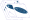

# LightCurver Documentation

## What is `LightCurver`?

`LightCurver` is a package / pipeline leveraging `STARRED` for precise photometry of blended sources in a large number of epochs.
It specifically tackles the following type of problem:

- The dataset has a large number of frames.
- The frames are oversampled wide-field images (think sky surveys, such as the upcoming Very Rubin LSST).
- Only a small portion of each frame if of interest (think supernova embedded in a galaxy, or lensed quasars).

The above type of problem has historically been hard to solve: obtaining high quality light curves for such datasets
was a mostly manual process, taking up to a few months of an investigator's time per light curve.
Doubt would also always remain: has all the available signal been extracted from the data? 
Are there systematics errors in the normalization that bias the shape of the extracted light curves?

`LightCurver` aims at making the process at least semi-automatic (set it up once for a few frames, then let the pipeline
automatically handle any future frame), and builds up on experience of manually reducing such datasets to offer 
a no-compromise photometric precision.
The end goal is being able to claim that the photometric uncertainty obtained in the light curves is dominated by 
the noise levels in the original frames, and not by normalisation or deblending scatter or systematics.

## Example result

The two figures below show `LightCurver` outputs for a dataset obtained at the ESO 2.2 meters telescope. (1)

1. ESO program `0106.A-9005(A)`, PI Courbin

The first image shows a calibrated cutout of the object of interest, a lensed quasar, from one of the wide-field images
of the dataset. The second image is the `STARRED` model, a high resolution image cumulating the signal of all the frames.
The last image is a Hubble Space Telescope image for comparison.

Finally, the other product are the lightcurves of the point sources.

## The method
`LightCurver` will prepare, for each frame, a precisely flux-calibrated cutout of the region of interest, together with a
ready-to-use PSF model. The pixels can then be precisely modelled with `STARRED`, in a so-called "joint-deconvolution".
This allows us to both obtain precise light curves of the point sources modelled with the PSF, and a high resolution
model that cumulates the signal of al the frames of the region of interest.
)